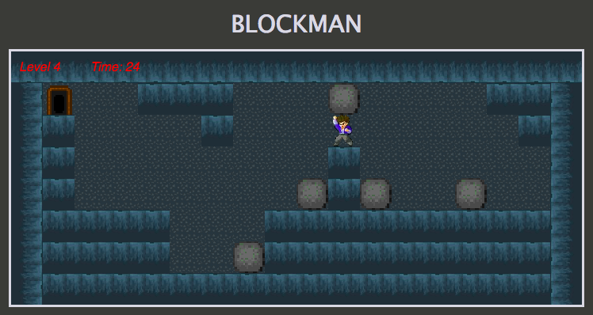

# BlockMan

Click [here][gh-pages] to play!

[gh-pages]: http://peterlin.co/BlockMan/

BlockMan is a browser game inspired by Block Dude.  It is written using JavaScript and HTML5.  The graphics are rendered using HTML canvas and CSS3.

### Description

Block Dude was written by Brandon Sterner for the TI-83+ and released in 2001.  BlockMan incorporates a slight twist to the original game - in this iteration, Block Man is trapped in a cave and you must help Block Man reach the exit.  In this platform-style game, Block Man's legs are not strong enough to allow him to jump.  You must utilize the blocks provided in the level to create a path for Block Man to climb on to exit!

### Instructions
← : Move left  
→ : Move right  
↑ : Climb onto a block (when standing next to one).  
↓ : Pick up block (when standing next to one) or drop a block (if holding one).  
R: Restart Level if you get stuck.  
Spacebar: Pause the level/timer.  
Escape: Quit game, you will lose all progress.  

### Level Creation

Levels are fairly simple to add as they are just a key-value pair of level number to a array-grid.  This POJO is stored in the constants folder as `levels.js`.  

## Future Directions for the Project

In addition to the features and gameplay already implemented, I plan to continue work on this project.  The next steps for BlockMan are outlined below.

### Music

I plan to add music to accompany the game.  I will look into ways to embed music when the game starts.

### Background graphics

I plan on adding torches in the caves and other miscellaneous images to spruce up the cave.

### Sprite movement Rendering

I plan on increasing the number of sprite images I have to Block Man so that I can render smooth movement of Block Man in the game.
